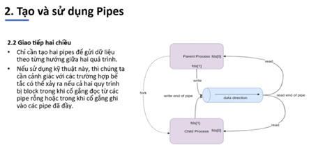
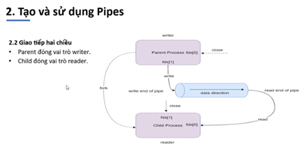
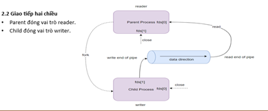

# Pipe

## 1. Khái niệm

- Pipe là phương thức IPC được sử dụng trong việc truyền thông liên tiếp trình
- Chỉ có thể sử dụng pipe sao cho một quá trình thực hiện ghi vào pipe và một trình trình đọc từ pipe
- pipe nằm trong RAM và được coi là một vartual file
- khi một process ghi vào virtual file thì tiến trình liên quan khác có thể đọc dữ liệu từ nó

```copy
#include <stdio.h>
#include <stdlib.h>
#include <unistd.h>

int main() {
    int fd[2];
    pid_t pid;

    // Tạo pipe
    if (pipe(fd) == -1) {
        perror("pipe");
        exit(1);
    }

    pid = fork();

    if (pid > 0) { // Tiến trình cha
        close(fd[0]); // Đóng đầu đọc
        write(fd[1], "Hello, child!", 14);
        close(fd[1]); // Đóng đầu ghi
    } else if (pid == 0) { // Tiến trình con
        close(fd[1]); // Đóng đầu ghi
        char buffer[20];
        read(fd[0], buffer, 14);
        printf("Received: %s\n", buffer);
        close(fd[0]); // Đóng đầu đọc
    }

    return 0;
}

```

## 2. Pipe giao tiếp hai chiều





## 3. FIFO - Named Pipes

- Pipes không được đặt tên và chỉ tồn tại trong suốt vòng đời của process
- FIFOs có tên trong hệ thống tện mà được mở giống như được một tệp thông thường
- Tồn tại miễn là hệ thống còn hoạt động, có thể xóa đi nếu không sử dụng
- file reader.c

```copy
#include <stdio.h>
#include <stdlib.h>
#include <fcntl.h>
#include <unistd.h>

int main() {
    const char *fifoPath = "/tmp/my_fifo";
    char buffer[100];

    // Mở FIFO để đọc
    int fd = open(fifoPath, O_RDONLY);
    read(fd, buffer, sizeof(buffer));
    printf("Reader received: %s\n", buffer);
    close(fd);

    // Xóa FIFO
    unlink(fifoPath);
    return 0;
}


```

- file writer.c

```copy
#include <stdio.h>
#include <stdlib.h>
#include <fcntl.h>
#include <unistd.h>

int main() {
    const char *fifoPath = "/tmp/my_fifo";
    char *message = "Hello from FIFO!";

    // Tạo FIFO nếu chưa tồn tại
    mkfifo(fifoPath, 0666);

    // Mở FIFO để ghi
    int fd = open(fifoPath, O_WRONLY);
    write(fd, message, strlen(message) + 1);
    close(fd);

    return 0;
}

```
